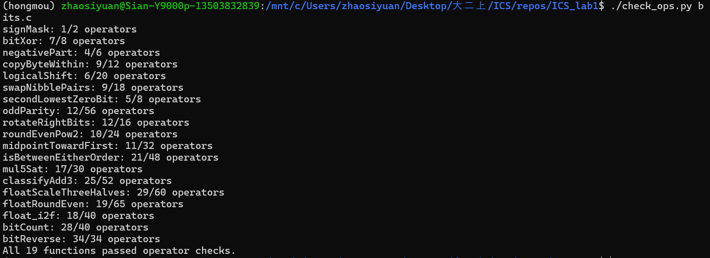
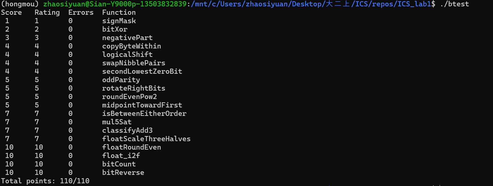

# Lab1: DataLab 实验报告

| 项目        | 内容                                |
| ----------- | ----------------------------------- |
| 姓名        | 赵思远                              |
| 学号        | 25303050004                         |
| GitHub 仓库 | https://github.com/LeoSian/ICS_lab1 |

---

## 一、环境与测试结果

### 1.1 环境

| 项     | 版本                                    |
| ------ | --------------------------------------- |
| 系统   | Windows 11 + WSL 2 / Ubuntu 22.04.5 LTS |
| 架构   | x86_64                                  |
| GCC    | 14.3.0                                  |
| Make   | 4.3                                     |
| Python | 3.12.13                                 |

32 位编译支持按实验文档安装。我的默认编译器是 gcc 14，只装文档里的 `gcc-multilib` 还不够，`-m32` 链接时会找不到 32 位的 libgcc，另外装了 `gcc-14-multilib` 才能编译。之后用文档里的命令编译，得到的 `btest` 是 32 位程序：

```bash
make clean
make all
```

### 1.2 `./check_ops.py bits.c`



19 个函数的运算符种类和数量都符合要求。其中 `bitReverse` 用了 34 个，正好等于上限，其余都有余量。

### 1.3 `./btest`



19 个函数的 Errors 都是 0，总分 110/110。推送到 GitHub 后，自动评分的结果也是 Points 110/110。

---

## 二、各函数的实现思路

整数题只能用 `! ~ & ^ | + << >>` 和 0–255 的常量，不能用 `if`、循环和减号，所以下面几个写法会反复出现：

- `x >> 31`：`int` 的右移是算术右移，负数得到全 1，非负数得到 0，可以当掩码用。
- `~x + 1`：补码取相反数，代替 `-x`。
- `(mask & a) | (~mask & b)`：`mask` 是全 1 或全 0 时，相当于在 a、b 之间二选一。
- 超过 255 的常量用移位和或运算拼出来，例如 `0x0F | (0x0F << 8)`。

### P1 signMask

```c
return 1 << 31;
```

把 1 左移 31 位，最高位为 1，其余位为 0，就是 `0x80000000`。

### P2 bitXor

```c
return ~(~x & ~y) & ~(x & y);
```

异或可以写成 `(x | y) & ~(x & y)`，意思是至少有一个为 1、但不同时为 1。题目只允许 `~` 和 `&`，所以用德摩根律把 `x | y` 换成 `~(~x & ~y)`。

### P3 negativePart

```c
int isNegative = x >> 31;
return (~x + 1) & isNegative;
```

`isNegative` 在 x 为负时是全 1，否则是 0。`~x + 1` 是 `-x`，和 `isNegative` 相与之后，负数保留 `-x`，非负数得到 0。x 为 `0x80000000` 时 `-x` 还是它自己，和参考实现的结果一致。

### P4 copyByteWithin

```c
int srcShift = src << 3;
int dstShift = dst << 3;
int byte = (x >> srcShift) & 0xFF;
int dstMask = 0xFF << dstShift;
return (x & ~dstMask) | (byte << dstShift);
```

字节号左移 3 位（乘 8）得到移位量。先把源字节右移到最低位，用 `0xFF` 取出来；再用 `~dstMask` 把目标字节清零；最后把取出的字节左移到目标位置，和清零后的 x 相或。例如 `copyByteWithin(0x11223344, 0, 2)`：取出的字节是 `0x44`，清零后是 `0x11003344`，结果是 `0x11443344`。

### P5 logicalShift

```c
int topBits = ((1 << 31) >> n) << 1;
return (x >> n) & ~topBits;
```

`int` 右移时高位补的是符号位，所以先正常右移，再把最高的 n 位清零。`(1 << 31) >> n` 的最高 n+1 位是 1，再左移一位，就得到最高 n 位为 1 的掩码。n 为 0 时这个掩码正好是 0，x 原样返回。

### P6 swapNibblePairs

```c
int lowNibbles = 0x0F | (0x0F << 8);
lowNibbles = lowNibbles | (lowNibbles << 16);
return ((x & lowNibbles) << 4) | ((x >> 4) & lowNibbles);
```

`lowNibbles` 是 `0x0F0F0F0F`，对应每个字节的低 4 位。每个字节的低 4 位取出来左移 4 位，高 4 位右移 4 位之后再取出来，两部分相或。右移之后再做一次 `&`，顺便去掉了算术右移补进来的符号位。例如 `0x12345678` 的结果是 `0x21436587`。

### P7 secondLowestZeroBit

```c
int filled = x | (x + 1);
return ~filled & (filled + 1);
```

`x + 1` 会把 x 最低的那个 0 变成 1，所以 `x | (x + 1)` 相当于把最低的 0 填上。对填好的数 `filled`，`~filled & (filled + 1)` 只在它最低的 0 那一位上是 1，这一位就是 x 第二低的 0。如果 x 里的 0 不足两个，`filled` 是全 1，结果为 0。例如 `0xFFFFFFFA`：`filled` 是 `0xFFFFFFFB`，结果是 `0x4`。

### P8 oddParity

```c
x = x ^ (x >> 16);
x = x ^ (x >> 8);
x = x ^ (x >> 4);
x = x ^ (x >> 2);
x = x ^ (x >> 1);
return ~x & 1;
```

把所有位异或起来，结果为 1 说明 1 的个数是奇数。每一步把高的一半异或到低的一半上，折叠 5 次以后，第 0 位就是 32 位的异或。题目要求 1 的个数为偶数时返回 1，所以最后取反再取最低位。

### P9 rotateRightBits

```c
int right = n & 31;
int left = (~right + 1) & 31;
int topBits = ((1 << 31) >> right) << 1;
return ((x >> right) & ~topBits) | (x << left);
```

`right` 是 n 除以 32 的余数。循环右移的结果由两部分拼成：x 逻辑右移 `right` 位（做法和 P5 相同），以及 x 左移 `32 - right` 位。`32 - right` 写成 `(~right + 1) & 31`，这样 `right` 为 0 时左移量也是 0，不会出现移 32 位的情况。例如 `rotateRightBits(0x12345678, 8)` 的结果是 `0x78123456`。

### P10 roundEvenPow2

```c
int half = (1 << n) >> 1;
int quotientIsOdd = (x >> n) & 1;
int biased = x + half + ~0 + quotientIsOdd;
return (biased >> n) << n;
```

把 x 写成 商 × 2^n + 余数，`half` 是 2^(n-1)。先给 x 加上 `half - 1`，再加上商的最低位，然后把低 n 位清零。余数大于 `half` 时一定会进位，小于 `half` 时一定不会；余数等于 `half` 时只差 1 就进位，进不进由商的奇偶决定，商是奇数才进，所以结果的商总是偶数。例如 n = 2 时，10 得到 8，14 得到 16。

### P11 midpointTowardFirst

```c
int diffBits = x ^ y;
int floorMid = (x & y) + (diffBits >> 1);
int xIsAbove = (floorMid + ~x + 1) >> 31;
return floorMid + (diffBits & xIsAbove & 1);
```

直接算 `x + y` 可能溢出。因为 `x + y = 2 * (x & y) + (x ^ y)`，中点向下取整可以写成 `(x & y) + ((x ^ y) >> 1)`，这样不会溢出。`x ^ y` 的最低位是 1 时和为奇数，真正的中点带 0.5。这时如果 `floorMid - x` 是负数，说明 x 在中点上方，应该取 `floorMid + 1`。例如 `(4, 7)` 得到 5，`(7, 4)` 得到 6。

### P12 isBetweenEitherOrder

```c
int xorA = x ^ a;
int xorB = x ^ b;
int diffA = x + ~a + 1;
int diffB = x + ~b + 1;
int lessA = diffA ^ (xorA & (diffA ^ x));
int lessB = diffB ^ (xorB & (diffB ^ x));
int belowOne = ((lessA ^ lessB) >> 31) & 1;
return belowOne | !xorA | !xorB;
```

x 在区间内有两种情况：x 只小于其中一个端点，或者 x 等于某个端点。`lessA` 的符号位表示 x < a 是否成立。两个数同号时相减不会溢出，看差的符号位；异号时负的那个更小，看 x 的符号位。`diffA ^ (xorA & (diffA ^ x))` 就是按 `xorA` 的符号位在这两者之间选择。`lessA ^ lessB` 的符号位为 1 表示两次比较的结果不同，`!xorA` 和 `!xorB` 处理和端点相等的情况。

### P13 mul5Sat

```c
int times4 = x << 2;
int times5 = times4 + x;
int overflow = ((x ^ (x << 1)) | (x ^ times4) | (x ^ times5)) >> 31;
int limit = (x >> 31) ^ ~(1 << 31);
return (overflow & limit) | (~overflow & times5);
```

5x 按 `(x << 2) + x` 计算。不溢出时 2x、4x、5x 的符号都和 x 相同，只要有一个不同就是溢出，`overflow` 相应地是全 1 或 0。`limit` 是溢出时要返回的值：x 非负时是 `0x7fffffff`，x 为负时是 `0x80000000`。最后用 `overflow` 在 `limit` 和 `times5` 之间选择。

### P14 classifyAdd3

```c
int sumXY = x + y;
int upXY = ((~x & ~y & sumXY) >> 31) & 1;
int downXY = (x & y & ~sumXY) >> 31;
int sum = sumXY + z;
int upZ = ((~sumXY & ~z & sum) >> 31) & 1;
int downZ = (sumXY & z & ~sum) >> 31;
return upXY + downXY + upZ + downZ;
```

分两次相加，每次记录溢出的方向：两个非负数加出负数记 +1，两个负数加出非负数记 -1，其余记 0。每溢出一次，算出来的结果和真实的和就相差 2^32，所以两次记录加起来是 +1 表示真实的和大于 `INT_MAX`，是 -1 表示小于 `INT_MIN`，是 0 表示没有越界。先向上溢出、再向下溢出的情况会互相抵消，也算没有越界。

### P15 floatScaleThreeHalves

```c
unsigned sign = uf & 0x80000000;
unsigned exp = (uf >> 23) & 0xFF;
unsigned mant = uf & 0x7FFFFF;
unsigned triple;
unsigned shift = 1;
unsigned dropped;
unsigned half;
if (exp == 0xFF)
  return uf;
if (exp == 0)
  exp = 1;
else
  mant = mant | 0x800000;
triple = mant + (mant << 1);
if (triple >> 25) {
  shift = 2;
  exp = exp + 1;
}
mant = triple >> shift;
dropped = triple & ((1 << shift) - 1);
half = 1 << (shift - 1);
if (dropped > half || (dropped == half && (mant & 1)))
  mant = mant + 1;
if (exp == 0xFF)
  return sign | 0x7F800000;
return sign | (((exp - 1) << 23) + mant);
```

乘 1.5 按“乘 3 再除以 2”来做。取出阶码和尾数以后，规格化数补上隐含的 1，非规格化数把阶码当作 1，这样两种情况的值都是 `mant × 2^(exp-150)`，可以放在一起处理。`triple` 是 `mant` 的 3 倍，没有误差。`triple` 小于 2^25 时右移 1 位；否则说明结果到了 2.0 以上，要右移 2 位，并把阶码加 1。右移丢掉的位按向偶数舍入处理。

最后用 `((exp - 1) << 23) + mant` 拼回去：`mant` 第 23 位上的 1 会加到阶码上，舍入产生的进位也会自动进到阶码；结果是非规格化数时阶码仍然是 0。阶码到 255 时返回无穷大，输入是 NaN 或无穷大时直接返回原值。

### P16 floatRoundEven

```c
unsigned sign = uf & 0x80000000;
unsigned magnitude = uf & 0x7FFFFFFF;
unsigned exp = magnitude >> 23;
unsigned one;
unsigned fraction;
unsigned half;
if (exp >= 150)
  return uf;
if (exp < 127) {
  if (magnitude > 0x3F000000)
    return sign | 0x3F800000;
  return sign;
}
one = 1 << (150 - exp);
fraction = uf & (one - 1);
half = one >> 1;
uf = uf - fraction;
if (fraction > half || (fraction == half && (uf & one)))
  uf = uf + one;
return uf;
```

分三种情况。阶码不小于 150 时，数值本身已经是整数，NaN 和无穷大也落在这里，直接返回。阶码小于 127 时绝对值小于 1，结果只能是 0 或 1：位模式大于 0.5（`0x3F000000`）的得到 ±1，其余得到带符号的 0。

剩下的情况里，尾数的低 `150 - exp` 位是小数部分，`one` 是位模式中代表 1 的那一位。先减掉小数部分，再比较小数部分和 `half`，决定要不要加上 `one`；两者相等时，整数部分是奇数才加。加法直接在位模式上做，进位会自动传到阶码，例如 1.5 变成 2.0。

### P17 float_i2f

```c
unsigned sign = x & 0x80000000;
unsigned magnitude = x;
unsigned exp = 157;
unsigned dropped;
if (x == 0)
  return 0;
if (sign)
  magnitude = -magnitude;
while (!(magnitude & 0x80000000)) {
  magnitude = magnitude << 1;
  exp = exp - 1;
}
dropped = magnitude & 0xFF;
magnitude = magnitude >> 8;
if (dropped > 0x80 || (dropped == 0x80 && (magnitude & 1)))
  magnitude = magnitude + 1;
return sign | ((exp << 23) + magnitude);
```

0 直接返回。其他情况先记下符号、取绝对值，然后一直左移到最高位为 1，每移一位阶码减 1。这时高 24 位是要保留的有效数字，低 8 位要舍去：大于 `0x80` 进位，等于 `0x80` 时保留的部分是奇数才进位。阶码的初值取 157 而不是 158，是因为保留部分第 23 位上隐含的 1 会在最后相加时给阶码加 1。例如 `float_i2f(5)` 的结果是 `0x40a00000`，`float_i2f(16777217)` 会舍入成 16777216。

### P18 bitCount

```c
int mask1 = 0x55 | (0x55 << 8);
int mask2 = 0x33 | (0x33 << 8);
int mask4 = 0x0F | (0x0F << 8);
mask1 = mask1 | (mask1 << 16);
mask2 = mask2 | (mask2 << 16);
mask4 = mask4 | (mask4 << 16);
x = (x & mask1) + ((x >> 1) & mask1);
x = (x & mask2) + ((x >> 2) & mask2);
x = (x + (x >> 4)) & mask4;
x = x + (x >> 8);
x = x + (x >> 16);
return x & 0x3F;
```

分治求和。先用 `0x55555555` 把相邻的两位相加，每 2 位里存这两位中 1 的个数；再用 `0x33333333` 把相邻的两个 2 位字段相加，变成每 4 位一个计数；然后是每 8 位一个计数。最后把 4 个字节的计数加到最低字节，取低 6 位。

### P19 bitReverse

```c
int mask16 = 0xFF | (0xFF << 8);
int mask8 = mask16 ^ (mask16 << 8);
int mask4 = mask8 ^ (mask8 << 4);
int mask2 = mask4 ^ (mask4 << 2);
int mask1 = mask2 ^ (mask2 << 1);
x = (x << 16) | ((x >> 16) & mask16);
x = ((x & mask8) << 8) | ((x >> 8) & mask8);
x = ((x & mask4) << 4) | ((x >> 4) & mask4);
x = ((x & mask2) << 2) | ((x >> 2) & mask2);
x = ((x & mask1) << 1) | ((x >> 1) & mask1);
return x;
```

也是分治：先交换高低 16 位，再交换每 16 位里的两个字节，然后依次是每个字节里的两个半字节、每 4 位里的两组 2 位、每 2 位里的两位。这题的运算符上限是 34，5 个掩码如果各自用常量拼，总数是 40 个，会超。所以改成从 `0x0000FFFF` 开始一个一个推出来：`mask16 ^ (mask16 << 8)` 得到 `0x00FF00FF`，同样的办法依次得到 `0x0F0F0F0F`、`0x33333333`、`0x55555555`，每个掩码只用 2 个运算符，总数正好 34。

---

## 三、参考资料与 AI 使用说明

- 实验文档、仓库的 `README.md` 和 `bits.c` 里各题的注释。
- 《深入理解计算机系统》（原书第 3 版）第 2 章：补码、移位运算、IEEE 754 单精度格式和向偶数舍入。
- AI 使用说明：本次实验使用了 Claude Code。完成了知识点讲解，环境配置以及人工书写代码后检查工作。

---

## 四、建议

1. 环境配置里的 32 位库。文档的命令装的是系统自带 gcc 对应的 32 位支持。我的默认编译器是 gcc 14，装完 `gcc-multilib` 后 `make all` 仍然报 `cannot find -lgcc`，要再装 `gcc-14-multilib` 才行。建议在“编译提示缺少 32 位库”一条里补充：gcc 不是系统自带的版本时，要安装对应版本的 multilib 包。
2. 本地和线上的编译参数不同。Makefile 默认带 `-m32`，GitHub 上的自动评分不带。建议在文档里说明这一点：装不上 32 位库的同学可以用 `make all CFLAGS='-O -Wall -fwrapv'`，这样编译方式和线上一致。
3. `bits.c` 开头的英文说明沿用了原版，里面要求用 dlc 和 BDD 检查器检查解答；而实验文档要求用 `check_ops.py`，不要直接运行 `./dlc bits.c`，仓库里也没有 BDD 检查器。建议在 `bits.c` 的说明里注明以实验文档为准。
4. 实验文档的简介写的是“CSAPP 第一章配套实验”，实验内容对应的应该是教材第 2 章“信息的表示和处理”。
